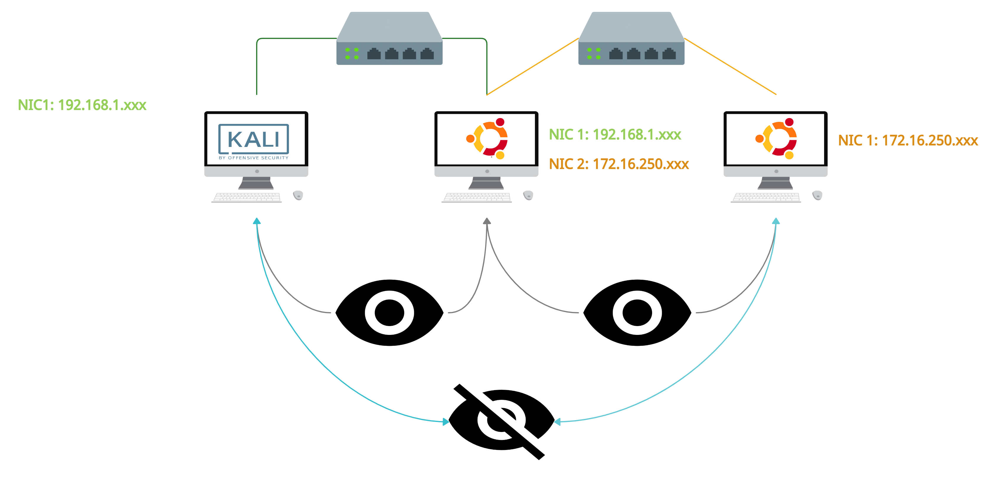

# Realizando Tunneling \(pivoting\) y Port Forwarding 101\(Hands-on Labs\)

## **TL;DR**

Por lo general cuando hablamos de pivoting las personas del campo de la informática conocen el termino y aseguran saber lo referente al tema. Sin embargo, la realidad es distinto cuando pasas a la práctica. Sin embargo, me dedique el fin de semana a levantar un laboratorio para practicar pivoting y Port Forwarding, el objetivo de este laboratorio era entender de manera práctica las técnicas mencionadas.

El motivo de este laboratorio surgió por que en la actualidad para poder realizar este tipo de prácticas debes afiliarte a algunas de las plataformas que encuentras en la red y muchas de estas plataformas \(no todas\) debes realizar un pago para poder ejercer este tipo de prácticas. 

En respuesta a esta situación decidí realizar el lab, sin necesidad de afiliarme o pagar por practicar  y aprender las diversas técnicas de pivoting, Port Forwarding o Tunelling. 

## Para este laboratorio, vamos a necesitar 3 maquinas virtuales:

1. Kali
2. Ubuntu puede ser la versión 18 o la última versión
3. Metasploitable 2

Para virtualizar estas máquinas utilizaremos VMware y VirtualBox.

La Kali la desplegaremos con VMware.

La Ubuntu y Metasploitable 2 las desplegaremos VirtualBox.

### Configuraciones del Ambiente de Pruebas - Red

Para nuestra Kali vamos a tener la configuración de su red en modo _**Bridged**_.


Nuestra Máquina con  Ubuntu tendrá instalada dos tarjetas de red. Una de estas estará configurada en modo _**Bridged**_ y la otra tarjeta de red en modo _**Only-Host.**_


Nuestra Metasploitable tendra solo una tarjeta de red y estará en modo _**Only-Host**._


De esta manera tendremos nuestra Kali compartiendo el mismo segmento de red que nuestra Ubuntu. Nuestra Ubuntu tendrá acceso al segmento de red que comparte con la Kali y tendrá visibilidad también sobre la Metasploitable pero nuestra Kali no lograra tener visibilidad sobre la Metasploitable.

Es importante realizar estas configuraciones de la manera correcta,  para evitar confusiones en esta parte provocarían que el laboratorio salga mal \(créanme puede salir todo mal...\).


De manera gráfica nuestro ambiente de pruebas seria el siguiente.




### Configuraciones del Ambiente de pruebas - Servicios

Para efectos practicas únicamente instalaremos en la Ubuntu los servicios de **SSH** y **Apache**.

**SSH**: para poder alcanzar el otro segmento de red y realizar Port Forwarding.

**Apache**: para demostrar que logramos alcanzar un servicio desplegado sobre **localhost** únicamente.

#### Instalando y Configurando Apache

Instalamos Apache

```text
apt install apache2
```

Iniciamos el servicios

```text
sudo systemctl start apache2
```

Por defecto el servicio se despliega de forma que otras máquinas pueden alcanzar el servicio desde afuera, esto debemos modificarlo para que se despliegue sobre **localhost**.

El fichero que demos modificar esta en la ruta:

```text
/etc/apache2/ports.conf
```

Esta fichera vendrá por defecto de la siguiente manera:


Reemplazaremos **0.0.0.0:80** por **127.0.0.1:8080**. \(Pueden escoger el puerto que ustedes decidan\).

Nos quedaria asì:


Luego reiniciamos el servicio para aplicar cambios.

```text
sudo systemctl restart apache2
```

#### Instalando y Configurando SSH

Instalamos SSH Server

```text
apt install openssh-server
```

Habilitamos el servicios y lo iniciamos

```text
systemctl enable ssh
systemctl start ssh
```

NOTA: por defecto no se permite iniciar sesión por ssh con usuario root, necesitan crearse un usuario nuevo o habilitar el inicio de sesión del usuario root.

## Port Forwarding

### Para esta prueba utilizaremos dos herramientas:

* Metasploit
* SSH

El motivo de usar estas dos técnicas es para aprender las maneras de realizar el Port Forwarding... **"si en tal situaciòn nos encontramos con que no podemos o no queremos ejecutar el metasploit"**

### Utilizando Metasploit

Para esta técnica necesitaremos tener credenciales validas sobre la maquina que queremos vulnerar.

Consiste en establecer una conexión segura entre un usuario de máquina victima y nuestra maquina.

En el siguiente ejemplo demostrare como alcanzar el servicio de Apache que se encuentra desplegado sobre localhost \(no se puede acceder al servicio desde otra máquina\). Selecionaremos un puerto en nuestra máquina para redirigir el tráfico. Para esta técnica deberemos tener una sesion con Meterpreter.

Para esto iniciamos el metasploit

```text
msfconsole
```

Ejecutamos los siguientes comandos:

```text
use auxiliary/scanner/ssh/ssh_login 
set rhosts <IP ADDRESS>
set username <USERNAME>
set password <PASSWORD>
exploit 
sessions -u 1 //para escalar nuestra sesion a meterpreter
sessions 2 // para interactuar con la nueva sesión que fue creada
netstat -antp //para listar los servicios activo en la máquina víctima
```

Una vez ingresado estos comandos tendremos las siguientes salidas


Y,  ¿Como sabemos que realmente estamos dentro de la maquina victima \(Ubuntu\)?

Pues.. para esto corremos el siguiente comando

```text
getuid
```


Este comando permite consultar el usuario sobre el cual se esta ejecutando el proceso del meterpreter.

Una vez que ya validamos que en efecto somos el usuario de la maquina Ubuntu necesitamos enumerar las conexiones activas que mantiene nuestro Ubuntu.

Para esto ejecutamos el siguiente comando:

```text
netstat -antp
```

Este comando se traduce de la siguiente manera:

* a visualiza todas las conexiones y puertos TCP y UDP, incluyendo las que están "en escucha" \(listening\).
* n se muestran los puertos con su identificación en forma numérica y no de texto.
* t es para especificar que sea tcp.
* p es para desplegar el PID.


Una vez ya ejecutado nuestro **netstat** podemos visualizar que para la linea 4 existe el servicio que previamente se habia configurado \(Apache2\) y se esta ejecutando sobre 127.0.0.1:8080.

Validamos si logramos alcanzar el servicio que esta ejecutando en el puerto 8080 desde nuestra Kali.


Y en efecto... no podemos alcanzar el servicio remotamente ya que se esta ejecutando sobre **localhost**.

Dentro de nuestra sesión meterpreter, lanzaremos el siguiente comando para poder realizar nuestro Port Forwarding o redirecciòn de puertos.

```text
portfwd add -l 8081 -p 8080 -r 127.0.0.1
```

El comando portfwd, es un comando que funciona para realizar redirecciones de puertos. De esta manera podemos enviar todo el trafico de nuestro puerto 8080 \(Ubuntu\) a nuestro puerto 8081 \(kali\). El comando add para añadir. La flag **-l** indica cual sera nuestro puerto local donde redirigiremos el  servicio , la flag **-p** es el puerto remoto al cual queremos conectarnos y el flag **-r** es el ip de la maquina a donde redigiremos el tráfico \(nuestra máquina\).


Seguido de esto realizamos la prueba abriendo nuestro navegador en la kali con la direccciòn del localhost:8081


Y como asegura el Apache2.. It works!.

### Port Forwarding o redireccionamiento de puertos con SSH local

Se utiliza el protocolo SSH para reenviar los puertos de la aplicación desde una máquina cliente a la máquina atacante. El cliente SSH escucha las conexiones en un puerto que ha sido configurado y hace un túnel a un SSH cuando se recibe una conexión hacia nuestra Kali o maquina atacante.

Para esto debemos conocer credenciales de la maquina victima.

```text
ssh -L 8081:localhost:8080 -N -f -l juss 192.168.1.139
```

Este comando se traduce de la siguiente manera:

* Tenemos el flag -L 8081:localhost  que representa el puerto escucha de nuestra maquina Kali
* :8080 que representa el puerto de la maquina que queremos escuchar \(Ubuntu\)
* -N para no ejecutar comandos remotos, el cual es especial para hacer forwarding de puertos.
* -f  para enviar nuestro comando de ssh al background, de esta manera se ejecutara los otros flags mientras tengamos nuestra conexiòn abierta
* -l para especificar el usuario de la maquina remota \(Ubuntu\)
* y seguido la ip de nuestra Ubuntu


Nuestro proceso SSH pasa al background, revisamos en nuestro explorador la ruta **localhost:8081**.


De esta manera conseguimos realizar un Port Forwarding entre nuestras maquinas.

## Pivoting

Este es el proceso que se utiliza para acceder los recursos de una red a la cual no tenemos acceso, desde una red que previamente que ya hayamos vulnerado y que si tenga visibilidad sobre esta red. Quiere decir que a travez de esta tecnica podremos llegar a un redes a traves de otras redes.

Para este laboratorio utilizaremos Ubuntu y Metasploitable como victimas.

### Sshuttle

Esta herramienta nos permite enrutar redes SSH como si fuese conexiones de vpn.

Con el Sshuttle realizaremos una conexiòn desde nuestra kali, hacia nuestro Ubuntu, y desde la ubuntu alcanzar los recursos o servicios de la Metasploitable.

Para este laboratorio necesitamos tener nuestras IPs a mano.

Kali


Ubuntu


Metasploitable 2


Instalacion de  Sshuttle.

```text
apt install sshuttle
```

En este caso como ya tengo instalado el Sshuttle me saldra el siguiente mensaje:


Seguido a la instalaciòn decidimos corroborar que en efecto no tenemos acceso a ver la Metasploitable2.

NOTA: si les da algun tipo de error al realizar la conexcion con sshuttle, reinstalar sshuttle.


En efecto, no mantenemos visibilidad sobre el equipo Metasploitable2.

Ejecutamos nuestro binario **Sshuttle**

```text
sshuttle -vr juss@192.168.1.139 172.16.250.129/16
```

La cual detallamos de la siguiente manera:

* -v  este flag indica con la \(-v\) de verbose, de esta manera obtendremos una salida a la sentencia para poder ver lo que ocurre en el momento
* -r permite ingresar un usuario.
* seguido el usuario junto con la direcciòn ip 192.168.1.139 \(ubuntu\) y la direcciòn del segmento o cidr 172.16.250.129/16 \(Metasploitable\).


Una vez ejecutado la sentencia podemos observar en nuestro explorador de la Kali la IP del Metasploitable.


De esta manera con la herramienta Sshuttle podemos ver desde nuestra kali el segmento de red que mantiene la Metasploitable.

### Chisel

Chisel es un túnel TCP / UDP rápido, transportado a través de HTTP, protegido a través de SSH. Un ejecutable que incluye tanto al cliente como al servidor. Escrito en Go \(golang\). Chisel es principalmente útil para atravesar firewalls, aunque también puede usarse para proporcionar un punto final seguro en su red.

Para instalarlo debemos realizar primero la descarga desde el github y seguido la instalacion del lenguaje golang

```text
git clone https://github.com/jpillora/chisel.git
sudo apt install golang
```


En mi caso tanto el chisel como golang ya se encuentran instalados en mi equipo.

Una vez ya descargado nuestro git de chisel e instalado golang procedemos con ejecutar el comando build para crear un binario de la fuente o codigo del chisel.

Una vez ya ejecutado corremos el comando llamando a nuestro binario de chisel como servidor escucha por el puerto 8000

```text
go build -ldflags="-s -w"
./chisel server -p 8000 --reverse
```

El cual nos genera la sigueinte salida


Una vez ya ejecutado nuestro binario de chisel asignando el trafico al puerto 8000 , podemos corroborar si mantenemos acceso a la metasploitable2


Pues no... no tenemos acceso. En este punto, imaginamos que te preguntas... ¿Porque localhost? y ¿ Porque ese puerto? por que no es el que señalo arriba el 8000? y si todas esas dudas la respondemos siguiendo este pequeño lab.

Seguido a esto realizamos la instalaciòn del chisel en nuestro Ubuntu

```text
git clone https://github.com/jpillora/chisel.git
sudo apt install golang
cd chisel/
sudo go build -ldflags="-s -w"
```

Supongamos que estamos ya dentro del equipo y realmente no sabemos que puertos tiene abierto el equipo del Metasploitable.

Para esto como ya tenemos acceso al equipo Ubuntu, podemos subir un binario del nmap y realizar el escaneo de la red. Para esto primero podemos descargar este binario de github que me fue muy util.

```text
https://github.com/andrew-d/static-binaries/blob/master/binaries/linux/x86_64/nmap
```

Una vez ya descargado generamos nuestro pequeño servidor en python para enviar archivos a nuestra maquina victima \(Ubuntu\).

```text
python -m SimpleHTTPServer 80
```


Y desde nuestra Ubuntu podemos descargarlo en la carpeta de temporales \(tmp\)


Una vez ya descargado nuestro binario debemos darle permiso de ejecucion con el comando chmod indicando las caracteristicas de ejecucion \(+x\)

```text
chmod +x nmap
```

Y lo ejecutamos con la siguiente sentencia:

```text
./nmap -Pn 172.16.250.133
```


Al tener listados los puertos de la Metasploitable 2 podemos proceder con nuestro comando de chisel.

```text
./chisel client 192.168.1.144:8000 R:5000:172.16.250.133:80
```

Lo cual se detalla a continuacion:

* cliente 192.168.1.144:8000 representa la maquina cliente que va a recibir al conexiòn, en este caso nuestra Kali con el puerto 8000
* R:5000 sera el puerto que veremos la conexiòn de nuestro kali
* :172.16.250.133:80 representa la ip de nuestro equipo Metasploitable con el puerto 80

Al ejecutar este comando tendremos la siguiente salida.


Y en nuestra kali veremos que obtuvimos la sesion 1.


Revisamos nuestro explorador con la direcciòn del **localhost:5000**.


Perfecto... tenemos conexiòn.. pero que pasa si en vez de utilizar el puerto 80 con el chisel en la Ubuntu utilizamos otro puerto?...

asignamos otro puerto en nuestro servidor escucha en la Kali

```text
./chisel server -p 8001 --reverse
```


Y en nuestro Ubuntu corremos otra sentencia del chisel pero cambiando los puertos. 8001 para nuestra kali reciba la nueva conexiòn, puerto 7000 para poder verlo en nuestra localhost de kali y el puerto 22 para el metasploitable que nos permite conectarnos por ssh. 

```text
./chisel client 192.168.1.144:8001 R:7000:172.16.250.133:22
```


Ahora revisamos nuestra kali....

Tenemos que se realizo una conexiòn en chisel por el puerto 7000


y probamos en este caso conectarnos desde nuestro localhost al puerto 7000 e ingresamos la pass de nuestro Metasploitable

```text
ssh msfadmin@127.0.0.1 -p 7000
```


Y como dice el Apache... It Works!

**Dynamic SSH Tunneling o Tunel SSH dinamico**

El túnel SSH dinámico proporciona una conexión con el rango de puertos haciendo que SSH funcione como un proxy SOCKS Kali Linux. _\*\*_El proxy SOCKS funciona como un tunel de ssh, el cual permite al atacante ver el trafico de internet que es enviado a la maquina victima. La tunelización dinámica puede recibir conexiones desde numerosos puertos. En nuestra maquina Kali corremos el siguiente comando

En nuestra Kali corremos el siguiente comando

```text
ssh -D 7000 juss@192.168.1.139
```

El cual detallamos a continuaciòn:

* -D 7000 permite que el soket de nuestor equipo Kali escuche por ese puerto el direcionamiento que proviene de la maquina Ubuntu que nos estamos conectando. Este paremetro funciona tanto para SOCKS4 y SOCKS5


Teniendo la conexiòn remota activa sobre nuestra maquina Ubuntu, decidimos realizar la prueba sobre nuestro explorador para saber si tenemos visibilidad sobre la Metasploitable2


Y en efecto, no mantenemos visibilidad.

Seguido a la prueba, realizamos la configuracionde conexiones en nuestro explorador

* Seleccionamos la opcion Manual proxy configuracion
* en SOCKS Host colocamos el ip de localhost \(127.0.0.1\)
* selecionamos en Port el puerto 7000 y que sea en SOCKS v5
* colocamos en el area de "no proxy for" la direccion del localhost


Le damos click en OK y cargamos la paguina con la direcciòn del metasploitable


De esta manera podemos ver la metasploitable2 desde nuestro kali

**Local SSH Tunneling o Tunel SSH local**

Esta tecnica permite realizar la conexiòn hacia nuestro Metasploitable2, desde el Ubuntu utilizando nuestra Kali con el flag -L

```text
ssh -L 7000:172.16.250.133:22 juss@192.168.1.139
```

Esta sentencia se detalla de la siguiente manera:

* -L 7000 indica el puerto escucha de la Kali
* :172.16.250.133:22 representa el ip de la Metasploitable con su puerto 22 \(SSH\)
* juss@192.168.1.139 es el usuario de la maquina Ubuntu con su ip


Una vez tenemos acceso estamos enviando el trafico de la Metasploitable2 a nuestro puerto 7000.

Ingresamos con el ssh al puerto 7000 y colocamos la contraseña

```text
ssh msfadmin@127.0.0.1 -p 7000
```


Y como dice el Apache ...It Works!


