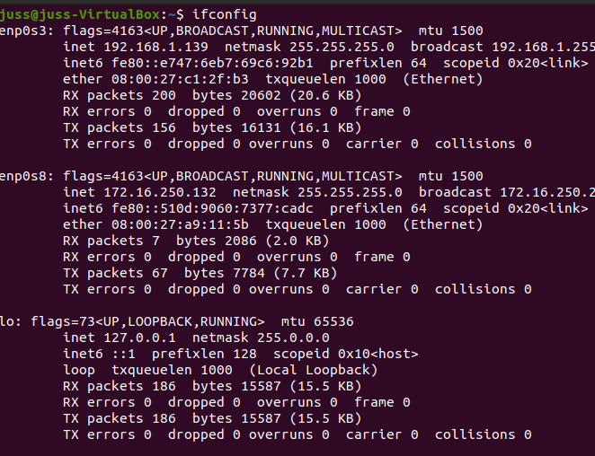

# Realizando Tunneling \(pivoting\) y Port Forwarding 101

Por lo general cuando hablamos de pivoting las personas en el mundo de la informatica conocen el termino y aseguran saber lo referente al tema. Sin embargo la realidad es distinto cuando pasas a la practica \(mi caso\) en el que muchos caemos. Sin embargo, me dedique el fin de semana a realizar el lab sobre pivoting para entender su proceso y diversas tecnicas que permitan realizar  el pivoting, tunneling o hasta un simple Port Forwarding, asi como aseguro en mi post de twiiter [https://twitter.com/jeg1200/status/1358634667054944258?s=20](https://twitter.com/jeg1200/status/1358634667054944258?s=20)

### Para este lab. vamos a necesitar 3 maquinas virtuales:

1. Kali
2. Ubuntu puede ser la version 18 o la ultima version
3. Metasploitable 2

Y para evitar aun mas que las maquinas puedan verse entre si usamos tanto VMware como VirtualBox.

Kali configurada en la VMware

Ubuntu y Metasploitable 2 en la VirtualBox


#### Configuraciones...parte 1

Para nuestra Kali vamos a tener la configuracion de su red en Bridged.


Nuestro Ubuntu tendra conexion con dos redes, la cual sera Bridged y un adaptador Only-Host \#4 que comparte con la metasploitable.


Nuestra Metasploitable tendra solo conexion al adaptador Only-Host \#4 


De esta manera tendremos que: Nuestra Kali comparte el mismo segmento de red que nuestra ubuntu, y nuestra ubuntu tiene acceso a la misma red que nuestra metasploitable. Pero nuesra Kali no ve la Metasploitable.

De igual manera es importante no mantener confunsion en esta parte ya que el lab puede salir mal \(creanme puede salir todo mal..\). 


#### Configuraciones...parte 2

Agregar APACHE 

#### 

#### 

### Port Forwarding

#### Utilizando Metasploit

Consiste en establecer una conexión segura entre un usuario remoto y las máquinas locales.

En este siguiente ejemplo podremos observar como nuestra Kali a travez del metasploit puede obtenere el acceso al ubuntu y seguido redireccionar lo nuestra ubuntu puede ver en el puerto 8080 a nuestro puerto 8081 en nuestra kali.

Para esto iniciamos el metasploit

```text
sudo msfconsole
```

ingresamos el siguiente parametro 

```text
use auxiliary/scanner/ssh/ssh_login 
set rhosts 192.168.1.139 
set username juss 
set password 1234 
exploit 
sessions -u 1 
sessions 2 
netstat -antp
```

Una vez ingresado estos parametros tendremos las siguientes salidas


Seguido corremos nuestro netstat y podremos observar que:

1. claramente estamos dentro de la ubuntu
2. podemos que esta el apache corriendo sobre el puerto 8080


Conociendo ya esto info utilizaremos el siguiente comando para poder realizar nuestro Port Forwarding o redirecciòn de puertos.

```text
portfwd add -l 8081 -p 8080 -r 127.0.0.1
```

El comando portfwd, es un comando que funciona para realizar redirecciones de puertos. De esta manera podemos enviar todo el trafico de nuestro puerto 8080 \(Ubuntu\) a nuestro puerto 8081 \(kali\). El comando add para añadir. La bander -l indica cual sera nuestro puerto escucha, la bander -p es el puerto a cual queremos conectarnos y el flag -r es el ip de la maquina a la que nos estamos conectando.


Seguido de esto realizamos la prueba abriendo nuestro navegador en la kali con la direccciòn del localhost:8081


Y como asegura el Apache2.. It works!

#### Port Forwarding o redireccionamiento de puertos con SSH local

Se utiliza el protocolo SSH para reenviar los puertos de la aplicación desde una máquina cliente a la máquina atacante. El cliente SSH escucha las conexiones en un puerto que ha sido configurado y hace un túnel a un SSH cuando se recibe una conexión hacia nuestra Kali o maquina atacante. 

Para esto claramente conocemos previamente el user y pass de la maquina victima

```text
ssh -L 8081:localhost:8080 -N -f -l juss 192.168.1.139
```

Este comando se traduce de la siguiente manera:

* Tenemos el flag -L 8081:localhost  que representa el puerto escucha de nuestra maquina Kali
* :8080 que representa el puerto de la maquina que queremos escuchar \(Ubuntu\)
* -N para no ejecutar comandos remotos, el cual es especial para hacer forwarding de puertos.
* -f  para enviar nuestro comando de ssh al background, de esta manera se ejecutara los otros flags mientras tengamos nuestra conexiòn abierta
* -l para especificar el usuario de la maquina remota \(Ubuntu\)
* y seguido la ip de nuestra Ubuntu


Como se menciono anteriormente nuestro ssh paso al background y revisamos en nuestro explorador la ruta localhost:8081


De esta manera conseguimos realizar un portForwarding entre nuestras maquinas.

### Tunneling 

Este es el proceso que se utiliza para acceder a los recursos de una red desde una red publica. Quiere decir que a tavez de esta tecnica podremos llegar a una subnet dentro de una red a la que desde un principio no tenemos acceso.

Para este lab como se meciono anteriormente utilizaremos el Metasploitable como victima...

#### Sshuttle

Esta herramienta nos permite enrutar redes ssh como si fuese conexiones de vpn.

Con el Sshuttle realizaremos una conexiòn desde nuestra kali, hacia nuestro Ubuntu, llamando a la red o ip del metasploitable

Para este Lab necesitamos tener nuestras ips a mano.

Kali


Ubuntu



Metasploitable 2


Seguido, como primer paso debemos realizar la instalacion de nuestro Sshuttle

```text
apt install sshuttle
```

En este caso como ya tengo instalado el Sshuttle me saldra el siguiente mensaje


Una vez ya instalado corremos la setencia 

```text
sshuttle -vr juss@192.168.1.139 172.16.250.129/16  
```

La cual detallamos de la sigueintee manera:

* -vr  este flag indica con la \(-v\) de verbose, de esta manera obtendremos una salida a la sentencia para poder ver lo que ocurre en el momento y la \(r\) permite ingresar un usuario.
* seguido el usuario junto con la direcciòn ip 192.168.1.139 \(ubuntu\) y la direcciòn del segmento o cidr 172.16.250.129/16 \(metasploitable\) 


Una vez ejecutado la sentencia podemos observar en nuestro explorador de la Kali la ip del metasploitable


De esta manera con la herramienta Sshuttle podemos ver desde nuestra kali el segmento de red que mantiene la Metasploitable.


#### Chisel

Chisel es un túnel TCP / UDP rápido, transportado a través de HTTP, protegido a través de SSH. Un ejecutable que incluye tanto al cliente como al servidor. Escrito en Go \(golang\). Chisel es principalmente útil para atravesar firewalls, aunque también puede usarse para proporcionar un punto final seguro en su red.

Para instalarlo debemos realizar primero la descarga desde el github y seguido la instalacion del lenguaje golang

```text
git clone https://github.com/jpillora/chisel.git
sudo apt install golang
```


En mi caso tanto el chisel como golang ya se encuentran instalados en mi equipo.

Una vez ya descargado nuestro git de chisel e instalado golang procedemos con ejecutar el comando build para crear un binario de la fuente o codigo del chisel.

Una vez ya ejecutado corremos el comando llamando a nuestro binario de chisel como servidor escucha por el puerto  8000

```text
go build -ldflags="-s -w"
./chisel server -p 8000 --reverse
```

El cual nos genera la sigueinte salida


Seguido a esto realizamos la instalaciòn del chisel en nuestro Ubuntu

```text
git clone https://github.com/jpillora/chisel.git
sudo apt install golang
cd chisel/
sudo go build -ldflags="-s -w"
```

Supongamos que estamos ya dentro del equipo y realmente no sabemos que puertos tiene abierto el equipo del Metasploitable...

Para esto como ya tenemos acceso al equipo Ubuntu, podemos subir un binario del nmap y realizar el escaneo de la red. Para esto primero podemos descargar este binario de github que me fue muy util.

```text
https://github.com/andrew-d/static-binaries/blob/master/binaries/linux/x86_64/nmap
```

 Una vez ya descargado generamos nuestro pequeño servidor en python para enviar archivos a nuestra maquina victima \(Ubuntu\) 

```text
python -m SimpleHTTPServer 80
```


y desde nuestra Ubuntu podemos descargarlo en la carpeta de temporales \(tmp\)


Una vez ya descargado nuestro binario debemos darle permiso de ejecucion con el comando chmod indicando las caracteristicas de ejecucion \(+x\)

```text
chmod +x nmap
```

y lo ejecutamos con la siguiente sentencia

```text
./nmap -Pn 172.16.250.133
```


Al tener ya los puertos abiertos y listados de la Metasploitable 2 podemos proceder con nuestro comando de chisel.

```text
./chisel client 192.168.1.144:8000 R:5000:172.16.250.133:80
```

Lo cual se detalla a continuacion:

* cliente 192.168.1.144:8000 representa la maquina cliente que va a recibir al conexiòn, en este caso nuestra Kali con el puerto 8000
* R:5000 sera el puerto que veremos la conexiòn de nuestro kali
* :172.16.250.133:80 representa la ip de nuestro equipo Metasploitable con el puerto 80

Al ejecutar este comando tendremos la siguiente salida


Y en nuestra kali veremos que obtuvimos la sesion 1 


Revisamos nuestro explorador con la direcciòn del localhost:5000


Perfecto... tenemos conexiòn.. pero que pasa si en vez de utilizar el puerto 80 con el chisel en la Ubuntu utilizamos otro puerto?...

asignamos otro puerto en nuestro servidor escucha en la Kali

```text
./chisel server -p 8001 --reverse
```


Y en nuestro Ubuntu corremos otra sentencia del chisel pero cambiando los puertos. 8001 para nuestra kali reciba la nueva conexiòn, puerto 7000 para poder verlo en nuestra localhost de kali y el puerto 22 para el metasploitable que nos permite conectarnos por ssh

```text
./chisel client 192.168.1.144:8001 R:7000:172.16.250.133:22
```


Ahora revisamos nuestra kali....

Tenemos que se realizo una conexiòn en chisel por el puerto 7000


y probamos en este caso conectarnos desde nuestro localhost al puerto 7000 e ingresamos la pass de nuestro Metasploitable

```text
ssh msfadmin@127.0.0.1 -p 7000
```


Y como dice el Apache... It Works! 


**Dynamic SSH Tunneling o Tunel SSH dinamico**

El túnel SSH dinámico proporciona una conexión con el rango de puertos haciendo que SSH funcione como un proxy SOCKS Kali Linux. ****El proxy SOCKS funciona como un tunel de ssh, el cual permite al atacante ver el trafico de internet que es enviado a la maquina victima. La tunelización dinámica puede recibir conexiones desde numerosos puertos. En nuestra maquina Kali corremos el siguiente comando

En nuestra Kali corremos el siguiente comando

```text
ssh -D 7000 juss@192.168.1.139
```

El cual detallamos a continuaciòn:

* -D 7000 permite que el soket de nuestor equipo Kali escuche por ese puerto el direcionamiento que proviene de la maquina Ubuntu que nos estamos conectando. Este paremetro funciona tanto para SOCKS4 y SOCKS5


Seguido realizamos la configuracion en nuestro explorador

* Seleccionamos la opcion Manual proxy configuracion
* en SOCKS Host colocamos el ip de localhost \(127.0.0.1\)
* selecionamos en Port el puerto 7000 y que sea en SOCKS v5
* colocamos en el area de "no proxy for" la direccion del localhost


Le damos click en OK y cargamos la paguina con la direcciòn del metasploitable


De esta manera podemos ver la metasploitable2 desde nuestro kali


